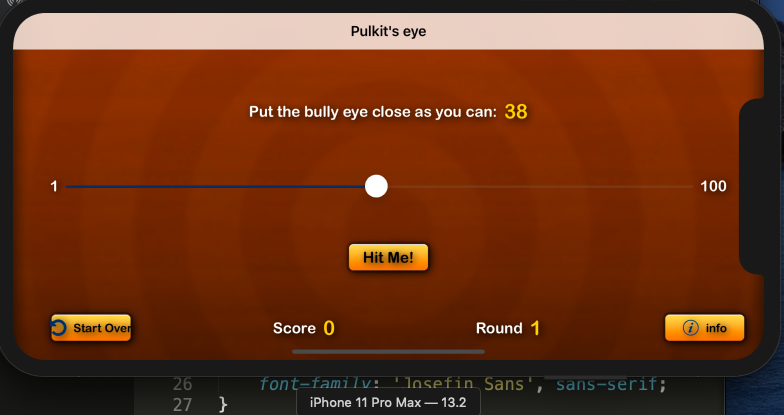

# :dart: Aman's Eye :dart:
### This Game is supported by i-phone 11 Pro Max. And developed in X-code 11 and by using Swift 5.1 and brand new [SwiftUI](https://developer.apple.com/xcode/swiftui/)

>My very first iOS game build using Swift 4. It's based on this amazing tutorial by Ray Wenderlich: [Your First iOS App](https://www.raywenderlich.com/ios/learn/)

# What is Aman's Eye?
This game challenges the user to slide the slider as close as possible to the
given value. The closer it gets, the higher the points.

## Rules:
 As much your slider value is closer to give chalange value you get higher points.
 :simple_smile: If differnce between slider value and challange value is "1" then you get '50' points as a bonus.
 :smiley: If differnce between slider value and challange value is "0" then you get '100' points as a bonus.

### Enjoy Coding..:relaxed:

